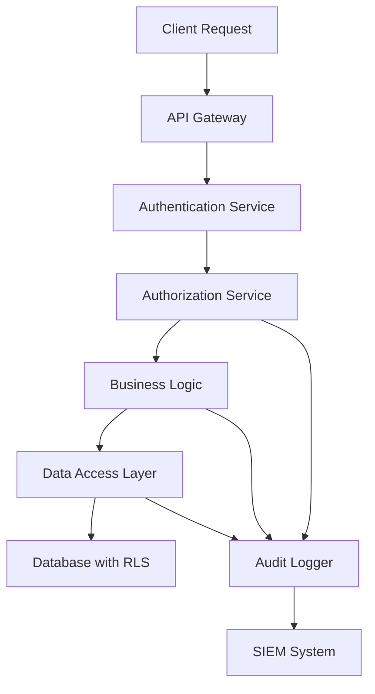

# IDOR Vulnerabilities: A Comprehensive Security Guide from the Trenches

---

## Introduction

During my tenure as a Senior Security Engineer at Google, I've witnessed firsthand how Insecure Direct Object References (IDOR) vulnerabilities continue to plague web applications across the industry. Despite being well-documented for over a decade, IDOR remains one of the most prevalent and dangerous security flaws in modern applications.

In this comprehensive guide, I'll share insights gained from securing Google's vast infrastructure, analyzing thousands of vulnerability reports, and working with development teams to build more secure systems. Whether you're a security professional, developer, or bug bounty hunter, this article will provide you with the deep understanding needed to identify, exploit, and prevent IDOR vulnerabilities.

## What Are IDOR Vulnerabilities?

Insecure Direct Object References occur when an application provides direct access to objects based on user-supplied input without proper authorization checks. In simpler terms, it's when you can change a number in a URL and access someone else's data.

### The Anatomy of an IDOR Attack

Consider this real-world scenario from a financial application we reviewed:

```
Normal request: GET /api/account/12345
Malicious request: GET /api/account/12346
```

If the application doesn't verify that the current user owns account 12346, it will return sensitive financial data belonging to another user. This simple manipulation can expose:

- Personal identification information
- Financial records
- Private communications
- Administrative functions
- Business-critical data

## The Five Types of IDOR Vulnerabilities

Through extensive security assessments at Google, I've categorized IDOR vulnerabilities into five distinct types, each requiring different detection and mitigation strategies.

### 1. Horizontal IDOR: Same-Level Access Violations

**Definition**: Users access resources belonging to other users at the same privilege level.

**Real-World Example**:
```javascript
// Vulnerable endpoint
app.get('/user/profile/:userId', (req, res) => {
    const profile = getUserProfile(req.params.userId);
    res.json(profile); // No authorization check!
});

// Secure implementation
app.get('/user/profile/:userId', authenticateUser, (req, res) => {
    if (req.params.userId !== req.user.id) {
        return res.status(403).json({error: "Access denied"});
    }
    const profile = getUserProfile(req.params.userId);
    res.json(profile);
});
```

**Impact**: Data breaches, privacy violations, regulatory compliance issues.

### 2. Vertical IDOR: Privilege Escalation

**Definition**: Regular users access administrative or higher-privilege resources.

**Case Study**: During a security review of an internal Google tool, we discovered that changing `/user/123` to `/admin/1` in the URL granted access to administrative functions. This type of vulnerability can be catastrophic.

**Example Attack Flow**:
```
1. Regular user discovers pattern: /api/user/profile/456
2. Attempts: /api/admin/profile/1
3. Gains access to administrative dashboard
4. Can now manage all users, view sensitive data, modify system settings
```

**Prevention**:
```python
def check_admin_access(user, resource):
    if not user.is_admin:
        raise PermissionDenied("Administrative access required")
    return True

@require_admin
def admin_dashboard(request):
    check_admin_access(request.user, 'admin_dashboard')
    return render_admin_dashboard()
```

### 3. Blind IDOR: Silent Data Manipulation

**Definition**: Attackers can modify or delete resources without seeing the actual data.

**Google's Experience**: We've seen cases where attackers could delete user accounts, modify settings, or trigger actions without receiving the actual data in the response.

**Example**:
```bash
# Attacker discovers they can delete their own document
DELETE /api/document/789
Response: {"success": true, "message": "Document deleted"}

# Attempts to delete other documents
DELETE /api/document/790
Response: {"success": true, "message": "Document deleted"}
# Another user's document is now deleted!
```

**Detection Strategy**:
- Monitor for unusual patterns in DELETE/PUT requests
- Implement comprehensive audit logging
- Use canary tokens in test data

### 4. Mass Assignment IDOR: Parameter Pollution Attacks

**Definition**: Attackers add unauthorized parameters to requests, modifying fields they shouldn't have access to.

**Advanced Example**:
```javascript
// Vulnerable update function
app.post('/user/update', (req, res) => {
    // Dangerous: Updates ALL fields from request body
    User.update(req.user.id, req.body);
    res.json({success: true});
});

// Attack payload
POST /user/update
{
    "name": "John Doe",
    "email": "john@example.com",
    "is_admin": true,        // Privilege escalation
    "user_id": 999,          // Modifying another user
    "balance": 1000000       // Financial manipulation
}
```

**Google's Mitigation Approach**:
```javascript
// Secure implementation with explicit field validation
const ALLOWED_FIELDS = ['name', 'email', 'phone'];

app.post('/user/update', (req, res) => {
    const updateData = {};
    
    // Only allow specific fields
    ALLOWED_FIELDS.forEach(field => {
        if (req.body[field] !== undefined) {
            updateData[field] = req.body[field];
        }
    });
    
    User.update(req.user.id, updateData);
    res.json({success: true});
});
```

### 5. Wrapped IDOR: Encoded Reference Attacks

**Definition**: Object references are encoded or obfuscated but still predictable or decodable.

**Sophisticated Attack Example**:
```javascript
// Application uses Base64 encoded user IDs
const userToken = btoa(JSON.stringify({user_id: 123, role: 'user'}));
// Generates: eyJ1c2VyX2lkIjoxMjMsInJvbGUiOiJ1c2VyIn0=

// Attacker decodes, modifies, and re-encodes
const decoded = JSON.parse(atob(userToken));
decoded.user_id = 124;
decoded.role = 'admin';
const maliciousToken = btoa(JSON.stringify(decoded));
```

**Secure Alternative**:
```javascript
// Use cryptographically signed tokens
const jwt = require('jsonwebtoken');
const SECRET_KEY = process.env.JWT_SECRET;

// Generate secure token
const token = jwt.sign({user_id: 123, role: 'user'}, SECRET_KEY);

// Verify token integrity
const verifyToken = (token) => {
    try {
        return jwt.verify(token, SECRET_KEY);
    } catch (error) {
        throw new Error('Invalid token');
    }
};
```

## Advanced Detection Techniques

### Automated Discovery Methods

At Google, we've developed sophisticated tools for IDOR detection. Here are some techniques you can implement:

#### 1. Parameter Fuzzing
```python
import requests
import itertools

def test_idor_parameters(base_url, auth_headers):
    """Test for IDOR vulnerabilities by fuzzing parameters"""
    test_ranges = [
        range(1, 1000),      # Sequential IDs
        range(1000, 2000),   # Different ranges
        [-1, 0, 999999],     # Edge cases
    ]
    
    vulnerable_endpoints = []
    
    for test_range in test_ranges:
        for param_value in test_range:
            response = requests.get(
                f"{base_url}/{param_value}",
                headers=auth_headers,
                timeout=5
            )
            
            if response.status_code == 200:
                # Analyze response for sensitive data
                if contains_sensitive_data(response.json()):
                    vulnerable_endpoints.append({
                        'endpoint': f"{base_url}/{param_value}",
                        'response_size': len(response.content),
                        'status_code': response.status_code
                    })
    
    return vulnerable_endpoints
```

#### 2. Multi-User Testing Framework
```python
class IDORTester:
    def __init__(self, users):
        self.users = users
        
    def test_cross_user_access(self, endpoint_template):
        """Test if users can access each other's resources"""
        results = []
        
        for user_a in self.users:
            for user_b in self.users:
                if user_a.id == user_b.id:
                    continue
                    
                # User A tries to access User B's resource
                endpoint = endpoint_template.format(user_id=user_b.id)
                response = requests.get(endpoint, headers=user_a.auth_headers)
                
                if response.status_code == 200:
                    results.append({
                        'attacker': user_a.id,
                        'victim': user_b.id,
                        'endpoint': endpoint,
                        'data_exposed': self.analyze_response(response)
                    })
        
        return results
```

### Behavioral Analysis

```python
def detect_idor_patterns(access_logs):
    """Detect suspicious access patterns that might indicate IDOR attacks"""
    suspicious_patterns = []
    
    for user_id, logs in group_by_user(access_logs):
        # Look for sequential ID scanning
        accessed_ids = extract_resource_ids(logs)
        if is_sequential_scan(accessed_ids):
            suspicious_patterns.append({
                'user_id': user_id,
                'pattern': 'sequential_scan',
                'accessed_resources': len(accessed_ids),
                'time_window': calculate_time_window(logs)
            })
        
        # Look for rapid resource enumeration
        if is_rapid_enumeration(logs):
            suspicious_patterns.append({
                'user_id': user_id,
                'pattern': 'rapid_enumeration',
                'requests_per_minute': calculate_rpm(logs)
            })
    
    return suspicious_patterns
```

## Comprehensive Prevention Strategies

### 1. Access Control Implementation

**The Google Approach**: We implement defense-in-depth with multiple layers of authorization checks.

```java
@RestController
public class DocumentController {
    
    @Autowired
    private AuthorizationService authService;
    
    @GetMapping("/api/document/{documentId}")
    public ResponseEntity<Document> getDocument(
            @PathVariable String documentId,
            Authentication auth) {
        
        // Layer 1: Authentication check
        if (!auth.isAuthenticated()) {
            return ResponseEntity.status(401).build();
        }
        
        // Layer 2: Resource ownership verification
        if (!authService.canAccessDocument(auth.getName(), documentId)) {
            return ResponseEntity.status(403).build();
        }
        
        // Layer 3: Business logic authorization
        Document document = documentService.findById(documentId);
        if (!authService.hasReadPermission(auth.getName(), document)) {
            return ResponseEntity.status(403).build();
        }
        
        return ResponseEntity.ok(document);
    }
}
```

### 2. Secure Reference Implementation

**UUID-Based References**:
```javascript
const { v4: uuidv4 } = require('uuid');

// Generate unpredictable references
const createDocument = (userId, content) => {
    const document = {
        id: uuidv4(), // e.g., "f47ac10b-58cc-4372-a567-0e02b2c3d479"
        owner_id: userId,
        content: content,
        created_at: new Date()
    };
    
    return database.documents.create(document);
};

// Always verify ownership
const getDocument = (documentId, currentUserId) => {
    const document = database.documents.findById(documentId);
    
    if (!document) {
        throw new NotFoundError('Document not found');
    }
    
    if (document.owner_id !== currentUserId) {
        throw new ForbiddenError('Access denied');
    }
    
    return document;
};
```

### 3. Database-Level Security

**Row-Level Security (RLS)**:
```sql
-- PostgreSQL Row Level Security example
CREATE POLICY user_documents_policy ON documents
    FOR ALL TO application_user
    USING (owner_id = current_setting('app.current_user_id')::integer);

-- Enable RLS
ALTER TABLE documents ENABLE ROW LEVEL SECURITY;
```

**Parameterized Queries with User Context**:
```python
def get_user_orders(user_id, current_user_id):
    """Secure database query with user context"""
    if user_id != current_user_id:
        raise PermissionError("Cannot access other users' orders")
    
    query = """
    SELECT * FROM orders 
    WHERE user_id = %s 
    AND user_id = %s  -- Double verification
    """
    
    return database.execute(query, (user_id, current_user_id))
```

## Advanced Mitigation Techniques

### 1. Context-Aware Authorization

```python
class ContextualAuthorizationService:
    def __init__(self):
        self.policies = PolicyEngine()
    
    def authorize_access(self, user, resource, action, context):
        """Multi-factor authorization decision"""
        
        # Check basic ownership
        if not self.is_owner(user, resource):
            return False
        
        # Check time-based access
        if not self.is_within_business_hours(context.timestamp):
            return False
        
        # Check location-based access
        if not self.is_authorized_location(user, context.ip_address):
            return False
        
        # Check rate limiting
        if self.is_rate_limited(user, action):
            return False
        
        # Check resource state
        if not self.is_resource_accessible(resource, context):
            return False
        
        return True
```

### 2. Audit and Monitoring

```python
class IDORMonitoringSystem:
    def __init__(self):
        self.alert_thresholds = {
            'sequential_access': 10,
            'failed_attempts': 5,
            'cross_user_attempts': 3
        }
    
    def log_access_attempt(self, user_id, resource_id, success, context):
        """Log all access attempts for analysis"""
        log_entry = {
            'timestamp': datetime.utcnow(),
            'user_id': user_id,
            'resource_id': resource_id,
            'success': success,
            'ip_address': context.ip_address,
            'user_agent': context.user_agent,
            'referer': context.referer
        }
        
        self.audit_logger.info(json.dumps(log_entry))
        
        # Real-time analysis
        if self.detect_suspicious_pattern(user_id, log_entry):
            self.trigger_security_alert(user_id, log_entry)
    
    def detect_suspicious_pattern(self, user_id, current_access):
        """Detect patterns indicative of IDOR attacks"""
        recent_accesses = self.get_recent_accesses(user_id, minutes=5)
        
        # Check for sequential resource access
        resource_ids = [access['resource_id'] for access in recent_accesses]
        if self.is_sequential_pattern(resource_ids):
            return True
        
        # Check for high failure rate
        failed_attempts = [a for a in recent_accesses if not a['success']]
        if len(failed_attempts) > self.alert_thresholds['failed_attempts']:
            return True
        
        return False
```

## Real-World Case Studies

### Case Study 1: E-commerce Platform IDOR

**Scenario**: A major e-commerce platform had an IDOR vulnerability in their order management system.

**Vulnerability**:
```
GET /api/orders/12345
```

**Impact**: 
- 2.3 million customer orders exposed
- Personal information, addresses, and purchase history leaked
- Estimated damage: $15 million in regulatory fines

**Root Cause Analysis**:
```javascript
// Vulnerable code
app.get('/api/orders/:orderId', authenticateUser, (req, res) => {
    // Only checks if user is logged in, not if they own the order
    const order = getOrderById(req.params.orderId);
    res.json(order);
});
```

**Fix Implementation**:
```javascript
// Secure implementation
app.get('/api/orders/:orderId', authenticateUser, (req, res) => {
    const order = getOrderById(req.params.orderId);
    
    if (!order) {
        return res.status(404).json({error: 'Order not found'});
    }
    
    // Verify ownership
    if (order.customer_id !== req.user.id) {
        return res.status(403).json({error: 'Access denied'});
    }
    
    res.json(order);
});
```

### Case Study 2: Healthcare System Vertical IDOR

**Scenario**: A healthcare management system allowed regular users to access administrative functions.

**Attack Vector**:
```
Normal: GET /api/patient/records/456
Attack: GET /api/admin/records/456
```

**Impact**:
- Access to all patient records
- HIPAA compliance violation
- $4.3 million in penalties

**Lessons Learned**:
1. Role-based access control must be enforced at every endpoint
2. Administrative functions should be on separate, secured endpoints
3. Regular security audits are essential

## Industry Best Practices

### Development Guidelines

1. **Secure by Design**
   ```python
   # Always include authorization in your base controller
   class SecureBaseController:
       def __init__(self):
           self.auth_service = AuthorizationService()
       
       def before_action(self, user, resource_id, action):
           if not self.auth_service.can_perform(user, resource_id, action):
               raise UnauthorizedError()
   ```

2. **Code Review Checklist**
   - [ ] Every endpoint has authentication
   - [ ] Every resource access has authorization
   - [ ] User input is validated and sanitized
   - [ ] Database queries use parameterized statements
   - [ ] Sensitive operations are logged

3. **Testing Requirements**
   - Unit tests for authorization logic
   - Integration tests with multiple user roles
   - Penetration testing for IDOR vulnerabilities
   - Automated security scanning in CI/CD

### Security Architecture



## Automated Testing and CI/CD Integration

### IDOR Detection in CI/CD Pipeline

```yaml
# .github/workflows/security-scan.yml
name: Security Scan
on: [push, pull_request]

jobs:
  idor-scan:
    runs-on: ubuntu-latest
    steps:
      - uses: actions/checkout@v2
      
      - name: Run IDOR Detection
        run: |
          # Custom IDOR scanner
          python scripts/idor_scanner.py --target ${{ env.STAGING_URL }}
          
      - name: SAST Analysis
        uses: securecodewarrior/github-action-add-sarif@v1
        with:
          sarif-file: 'security-scan-results.sarif'
```

### Custom IDOR Scanner

```python
#!/usr/bin/env python3
"""
IDOR Vulnerability Scanner
Designed for CI/CD integration
"""

import requests
import json
import sys
from urllib.parse import urljoin

class IDORScanner:
    def __init__(self, base_url, auth_tokens):
        self.base_url = base_url
        self.auth_tokens = auth_tokens
        self.vulnerabilities = []
    
    def scan_endpoints(self, endpoints):
        """Scan list of endpoints for IDOR vulnerabilities"""
        for endpoint in endpoints:
            self.test_endpoint(endpoint)
    
    def test_endpoint(self, endpoint_pattern):
        """Test specific endpoint pattern for IDOR"""
        # Test with different user contexts
        for i, token_a in enumerate(self.auth_tokens):
            for j, token_b in enumerate(self.auth_tokens):
                if i == j:
                    continue
                
                # User A tries to access User B's resource
                test_url = endpoint_pattern.format(user_id=j+1)
                headers = {'Authorization': f'Bearer {token_a}'}
                
                try:
                    response = requests.get(
                        urljoin(self.base_url, test_url),
                        headers=headers,
                        timeout=10
                    )
                    
                    if response.status_code == 200:
                        self.vulnerabilities.append({
                            'endpoint': test_url,
                            'attacker_token': i,
                            'victim_resource': j+1,
                            'response_size': len(response.content)
                        })
                        
                except requests.RequestException as e:
                    print(f"Error testing {test_url}: {e}")
    
    def generate_report(self):
        """Generate SARIF report for GitHub"""
        sarif_report = {
            "version": "2.1.0",
            "runs": [{
                "tool": {
                    "driver": {
                        "name": "IDOR Scanner",
                        "version": "1.0.0"
                    }
                },
                "results": []
            }]
        }
        
        for vuln in self.vulnerabilities:
            result = {
                "ruleId": "IDOR-001",
                "message": {
                    "text": f"IDOR vulnerability detected at {vuln['endpoint']}"
                },
                "locations": [{
                    "physicalLocation": {
                        "artifactLocation": {
                            "uri": vuln['endpoint']
                        }
                    }
                }],
                "level": "error"
            }
            sarif_report["runs"][0]["results"].append(result)
        
        return sarif_report

if __name__ == "__main__":
    if len(sys.argv) < 2:
        print("Usage: python idor_scanner.py <base_url>")
        sys.exit(1)
    
    base_url = sys.argv[1]
    
    # Load test configuration
    with open('idor_test_config.json', 'r') as f:
        config = json.load(f)
    
    scanner = IDORScanner(base_url, config['auth_tokens'])
    scanner.scan_endpoints(config['endpoints'])
    
    report = scanner.generate_report()
    
    with open('security-scan-results.sarif', 'w') as f:
        json.dump(report, f, indent=2)
    
    if scanner.vulnerabilities:
        print(f"Found {len(scanner.vulnerabilities)} IDOR vulnerabilities!")
        sys.exit(1)
    else:
        print("No IDOR vulnerabilities detected.")
        sys.exit(0)
```

## Conclusion

IDOR vulnerabilities represent a critical security risk that continues to affect applications across all industries. Through my experience at Google, I've learned that preventing IDOR requires a multi-layered approach combining secure development practices, comprehensive testing, and continuous monitoring.

### Key Takeaways

1. **Defense in Depth**: Implement authorization checks at multiple layers
2. **Secure by Design**: Build security into your architecture from the ground up
3. **Continuous Testing**: Automate IDOR detection in your CI/CD pipeline
4. **Monitor and Alert**: Implement real-time detection of suspicious access patterns
5. **Regular Audits**: Conduct periodic security reviews and penetration testing


